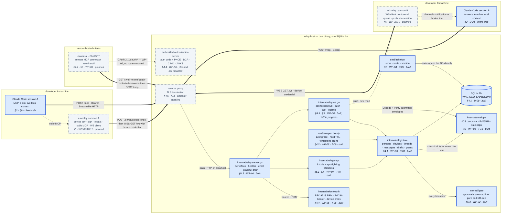
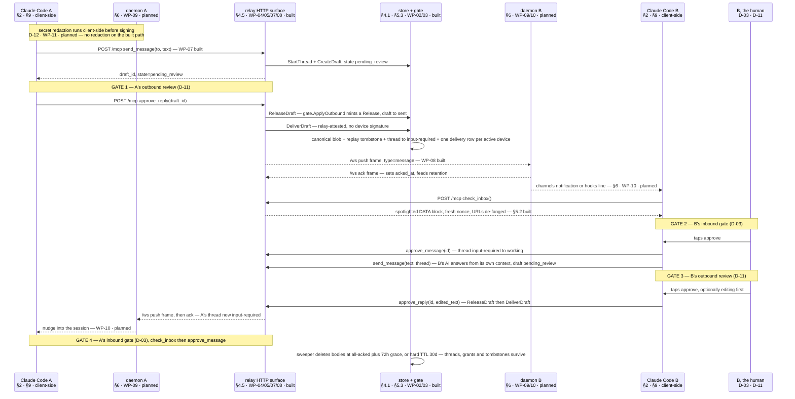
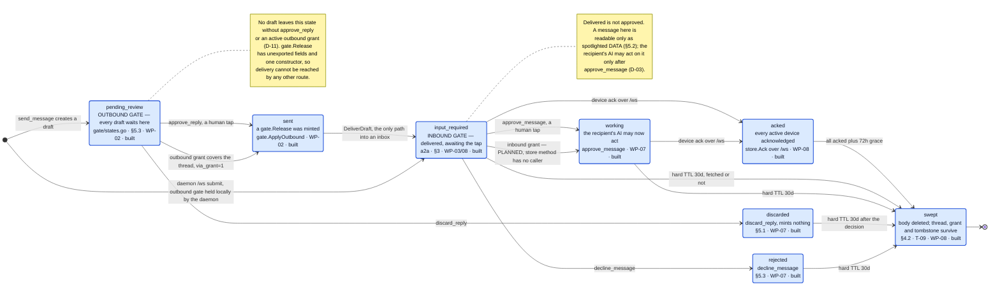
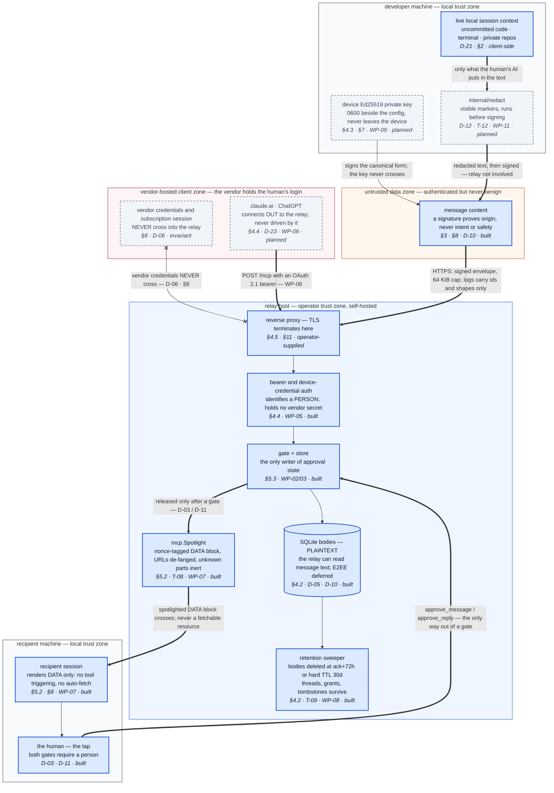

# askrelay — Architecture diagrams (overview set)

**Status:** the parent diagram set for the whole system. Every node and edge
traces to [`askrelay-architecture.md`](askrelay-architecture.md) (§ refs),
[`askrelay-implementation-plan.md`](askrelay-implementation-plan.md) (WP ids,
which win over the architecture doc), [`phase2-decision-log.md`](phase2-decision-log.md)
(D-xx), and the code on disk. Built-vs-planned is derived from the code, not
from the status board. Verified against the tree on **2026-08-03** (branch
`wp-08-delivery`).

Anything the sources imply but never specify is **not drawn** — it is listed in
[Open / unspecified](#open--unspecified) instead. Deeper per-subsystem charts
hang off the stable anchors below.

| View | Anchor |
|---|---|
| 1 — Component & deployment topology | [`#view-1--component--deployment-topology`](#view-1--component--deployment-topology) |
| 2 — End-to-end message lifecycle | [`#view-2--end-to-end-message-lifecycle`](#view-2--end-to-end-message-lifecycle) |
| 3 — Approval-gate state machine | [`#view-3--approval-gate-state-machine`](#view-3--approval-gate-state-machine) |
| 4 — Trust boundaries & data classification | [`#view-4--trust-boundaries--data-classification`](#view-4--trust-boundaries--data-classification) |
| Legend | [`#legend`](#legend) |

---

## View 1 — Component & deployment topology

Four hosts, one binary. The relay is a single Go process over one SQLite file;
the daemon is optional by hard rule (D-06) and not written yet, so every
push-into-the-session path is dashed. Solid boxes are code in this tree today.
The build frontier is visible on the right-hand side of the relay: the MCP
surface, the resource server, the WS hub and the sweeper are built; the embedded
authorization server that browser clients need is not, which is what keeps
claude.ai / ChatGPT dashed (D-23 put them off the critical path).

17 nodes. Detail deferred to the per-subsystem charts for `internal/relay/mcp`,
`internal/relay/oauth`, and `internal/relay/store`.

Two facts the boxes cannot show. **Nothing in the binary mints an access
token** — `oauth.Issuer.Mint` has no non-test caller, and `/mcp` refuses a
device credential (`use` claim mismatch, `oauth/token.go`), so every `POST /mcp`
edge above is exercised only by tests until WP-06 lands. The device-credential
path (`/enroll` → `/ws`) is complete end to end. And `internal/envelope` is
drawn inside the relay host because that is where it runs today; the same
package links into the daemon binary (§10).

---

## View 2 — End-to-end message lifecycle

One question and its answer. Read it for two things: where a human has to tap,
and where the design and the code diverge. The code gates **four** crossings per
round trip, not two — the docs foreground B's inbound gate and B's outbound
review (D-03, D-11), but `send_message` puts A's own ask in `pending_review`
too, and the arriving reply lands on A's side at `input-required`. Same two
gates, seen from both sides. Delivery on the released path is **relay-attested,
not signed**: `store.DeliverDraft` carries no device signature (its own
`ponytail:` note says so), because the author was authenticated when the draft
was created and released.

7 participants. The alternative ask path is the daemon's `/ws` submit frame
(`handleSubmit`, built): a signed envelope goes straight to `IngestMessage`
under the socket's authenticated identity, with the outbound gate held locally
by the daemon instead of by the relay — see [Open / unspecified](#open--unspecified).

---

## View 3 — Approval-gate state machine

The two gate states are the mandatory waypoints, so the invariant is structural
rather than decorative: `pending_review` is the outbound gate and
`input-required` is the inbound gate, and there is no edge into a recipient's
inbox that does not leave one of them. `sent` exists only where
`gate.ApplyOutbound` minted a `*gate.Release` — the type has unexported fields
and no other constructor — and `DeliverDraft` refuses any draft not already in
`sent`. The one path that skips the relay's outbound gate is the daemon's `/ws`
submit, drawn as its own entry into the inbound gate.

8 states. Transition status is carried in the label text, not the edge style:
`stateDiagram-v2` has no portable dashed-edge form. Three A2A states — `completed`,
`failed`, `canceled` — are defined in `internal/a2a` and reachable by no code
path today; `submitted` is written by `StartThread` and by `envelope.New`, but a
recipient-side thread row is created directly at `input-required`.

---

## View 4 — Trust boundaries & data classification

Four zones. The machine-local zone holds everything the relay must never see:
the live session context, the device private key, and the redaction pass that
runs *before* signing (D-12 — the relay is not involved). The vendor zone holds
the human's own login, which is the boundary the whole vendor-ToS posture rests
on: **the relay never sees vendor credentials** (D-06, §8) — all AI work happens
in the participant's own client under their own account. The relay zone is
honest about what it *can* see: message bodies are plaintext in SQLite (E2EE
deferred, D-05), and ephemeral retention is the mitigation, not encryption.
Message content itself is its own zone — authenticated but never benign (D-10).

14 nodes. `ctx_a` and `human_b4` are actors rather than packages; they carry the
decision that binds them instead of a package path. Detail deferred to the
threat-model document (WP-15, arch §8).

---

## Legend

**Status styling** — derived from the code on disk, cross-checked against the
plan's §1 status board.

| Styling | Meaning |
|---|---|
| Solid border, filled | Built: the code exists in this tree today. |
| Dashed border, muted fill | Not built here: a planned WP, or operator-supplied infrastructure (the reverse proxy). |

For nodes that are not packages (actors, credentials, content), the class
reflects whether the *mechanism* exists in the tree today.

**Edge styles**

| Style | Meaning |
|---|---|
| `-->` solid thin | Synchronous request or in-process call. |
| `==>` thick | Trust-boundary crossing — host to host, or untrusted content entering a session. |
| `-.->` dashed | Asynchronous push, or a hop whose implementation is planned. |
| `x--x` crossed | A crossing that must never happen (View 4 only). |
| `->>` / `-->>` | Sequence view: request / push-or-response. |

`stateDiagram-v2` carries edge status in the label text, since dashed
transitions are not portable there.

**Citation format** — every node label ends with an italic line:
`§<architecture section> · <WP id or decision> · <built | planned>`. A `T-xx` is
a technical decision from plan §5; a `D-xx` is a product verdict from the
decision log. Section numbers are `docs/askrelay-architecture.md`.

**Node budget** — roughly 20 nodes per view, hard ceiling 25. For sequence
diagrams the budget counts participants. Anything larger collapses to one node
with a "detail deferred" line beneath the diagram.

---

## Open / unspecified

Everything below is implied by the sources but not decided or not wired. None of
it is drawn as a box.

1. **Inbound grants are recorded but never consulted.**
   `store.ApproveInboundViaGrant` has no non-test caller, and no ingest,
   delivery, or read path reads an inbound grant row.
   `set_thread_grant(direction="inbound")` therefore writes an immortal audit
   row that changes nothing today; only the outbound grant fires
   (`ReleaseReplyViaGrant`, called from `send_message`). Drawn in View 3 as a
   labelled PLANNED transition. The thread-level `ApproveInbound` /
   `DeclineInbound` are likewise callerless — the tools use the message-level
   pair. §5.3 and D-03 describe the inbound grant as live.

2. **The `/ws` submit path has no relay-side outbound gate.** `handleSubmit`
   verifies the signature and the device→person binding, then calls
   `IngestMessage` directly: no draft, no `pending_review`, no `gate.Release`.
   The architecture puts that gate in the daemon (§6: "the daemon never
   auto-approves anything"), but the daemon is WP-09 and does not exist, so the
   relay-side property is currently "unexercised", not "enforced". The
   recipient's inbound gate still holds for a new thread.

3. **`/ws` submit onto an *existing* thread does not re-arm the inbound gate.**
   `ensureThread` deliberately never transitions an existing thread's state, and
   `handleSubmit` does not force `input-required` the way `DeliverDraft` does.
   A submitted message onto a thread already at `working` is stored and visible
   through `get_thread` (spotlighted), but never appears in `check_inbox` and
   gets no fresh per-message verdict. WP-08's own delivery obligation names this
   requirement; it is satisfied on the `DeliverDraft` path only.

4. **A revoked device keeps its live socket.** The open blocking finding:
   `Notify`/`pushInbox` never re-check `ActiveDeviceByID` and `RevokeDevice`
   never calls `hub.remove`/`CloseNow`, so a device revoked while connected is
   still pushed mail. Reproduced on 2026-08-03 —
   `TestWSRevokedDeviceStopsReceivingPush` fails. Not a gate bypass (the mail was
   already released), so View 3's invariant is unaffected; View 4's `/ws`
   boundary is drawn as it is *specified* (§4.3), not as it currently behaves.

5. **Delivery signing is contradicted between the plan and the code.** WP-08's
   "Delivery obligations" bullet says delivery signs the payload; `DeliverDraft`
   is relay-attested with no signature, and the same entry's "Current state"
   paragraph agrees with the code. The diagrams follow the code. Whether the
   released path should ever carry a device signature is undecided — it is
   entangled with the deferred browser-client signing model (D-23).

6. **Browser-client signing is an open wire-format decision** (D-23, WP-08
   entry): a browser MCP client has no local device key, and the choice between
   a relay-held browser-device key and read/approve-only browser clients is not
   made. Taken with WP-06 when the browser-connector path is wanted.

7. **No access token can be minted** until WP-06's authorization server exists,
   so the MCP surface has no live authentication path in the binary. The
   local-first loop (D-23) is unaffected: it runs over `/enroll` → `/ws`.

8. **Three A2A thread states are unreachable.** `completed`, `failed`, and
   `canceled` are defined in `internal/a2a` and validated by the gate, but no
   code path transitions into them. What closes a thread is unspecified.

9. **Not drawn from §6's push paths:** which of the channels bridge and the
   hooks fallback a given session gets is a WP-10 runtime decision gated on
   spike S-01. View 1 and View 2 show one dashed "nudge" edge rather than
   guessing the split.

10. **Client profiles** (§5.4) select a `wait_for_activity` cap from the token's
    `client_type` claim, which only WP-06's authorization server will stamp.
    Today `profileCap` falls through to the 45 s ChatGPT-safe default for every
    caller. Not drawn — it is a per-request property, not a component.
