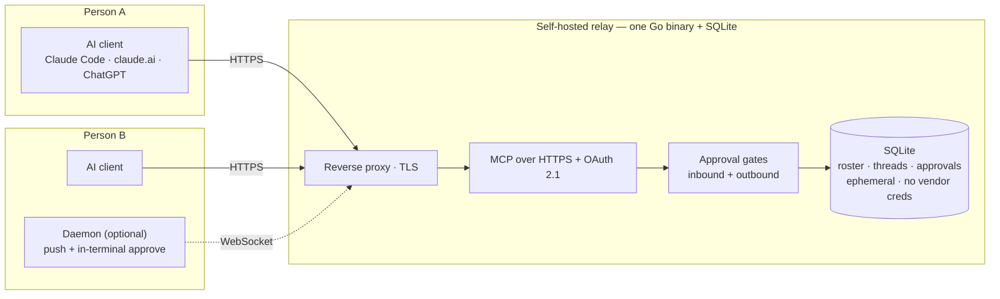
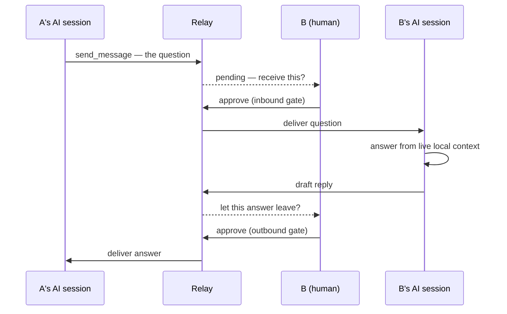
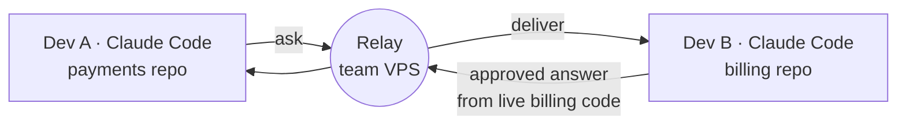
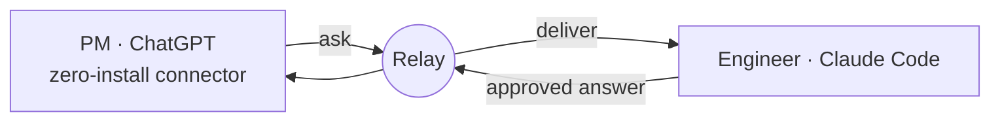
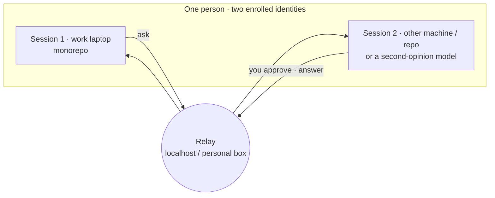
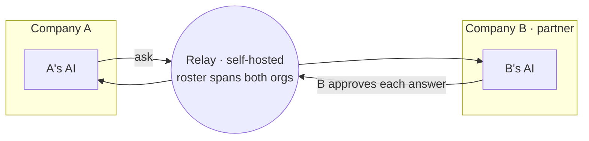
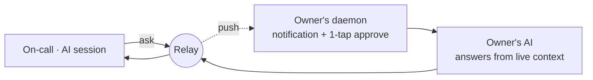

import { Aside } from '@astrojs/starlight/components';

askrelay's edge is not "an AI that searches a shared wiki." It is **a teammate's
AI answering from its own live, local context — with that human approving before
anything leaves.** Every scenario below passes one test: it genuinely needs *the
other person's AI, in its current context, human-gated.* If a Slack search or a
stale doc would do, it isn't here.

## How it fits together

One self-hostable Go binary (plus SQLite) sits between two people's AI clients.
Clients talk to it over HTTPS — MCP for the tools, OAuth 2.1 for identity. The
relay holds only ephemeral coordination state (roster, threads, pending
approvals); it never sees either side's vendor credentials, and **both
directions are approval-gated.**

A single "ask" crosses **two** approval gates — one where the question arrives,
one where the answer leaves — so no one's AI ever acts on, or answers, another
person's message without a human tap:

<Aside type="note">
In v1 every exchange is human-approved by design; there is no unattended
auto-reply. Browser clients (claude.ai, ChatGPT) pull on the user's turn; the
optional daemon adds real-time push and one-tap in-terminal approvals.
</Aside>

---

## 1. Cross-service answers without the sync tax

**Who:** one engineering team, everyone on Claude Code, relay on a shared VPS.

Dev A is deep in the `payments` service and hits behavior that actually lives in
`billing`, which they don't own. Instead of pinging Dev B on Slack and waiting
for a context-switch, A's session asks B's session directly:

> *"When payments calls `billing.charge` with a duplicate idempotency key, what
> does billing actually do?"*

B's Claude Code is **already in the billing repo**. B approves, B's AI answers
from the current code — exact function and line — and the answer lands back in
A's session.

**Why not Slack:** B answers from *live* code, not memory; A gets a precise
answer asynchronously; B vetted exactly what left. **Needs:** nothing beyond v1
(pull, or push with the daemon).

---

## 2. The mixed-tooling team

**Who:** a team split across AI vendors — PM/design on ChatGPT, engineers on
Claude Code.

The PM's ChatGPT connects to the relay as a **zero-install OAuth connector** —
nothing to install — and asks an engineer's session:

> *"Is the CSV export endpoint paginated, and what's the max page size?"*

The engineer approves; their AI answers from the code. askrelay is the only
thing here that bridges *different AI vendors* without forcing the whole team
onto one tool.

**Why it counts:** this is the cross-vendor demo askrelay was built for — A's
Claude Code ↔ B's ChatGPT, either direction. **Needs:** the embedded OAuth
authorization server (shipped), so browser clients connect with zero install.

---

## 3. Your own AI, across two contexts

**Who:** one person, no second human required — two of *your own* enrolled
sessions.

A work-laptop session lives in the monorepo; a second session runs on another
machine or repo (or is a different model you keep for second opinions). You ask
*your own* other session to pull context a repo away, or for an adversarial
second read — async, answered, and pulled back into the session you're working
in.

**Why it counts:** it's useful with a team of **one** — the honest answer to
"what if I'm the only user yet?" — so value doesn't depend on convincing someone
else to join first.

<Aside type="tip">
Self-talk needs two *distinct* enrolled identities: a thread is 1:1 and the
relay refuses a thread from someone to themselves.
</Aside>

---

## 4. Across the company boundary

**Who:** two organizations collaborating — e.g. a company and an integration
partner or contractor. One side self-hosts the relay; the other's people are
added to the roster.

Team A's AI asks Team B's AI implementation questions answered from B's live
service — no scheduled integration call, no exchange of stale API docs:

> *"What's the exact retry/backoff on your webhook delivery, and which events
> are at-least-once?"*

Every answer is human-approved by B, nothing is persisted beyond coordination
(ephemeral retention), roster membership is explicit, and the relay never
touches either side's vendor credentials.

**Why it counts:** this is where the **approval gate + self-hosting +
roster-only** stop being overhead and become the entire reason it's *safe* to
connect AIs across an org boundary — the cross-vendor, self-hosted, open-source
combination nothing else offers.

---

## 5. Escalate to the owner during an incident

**Who:** an on-call engineer and a service owner — with the **daemon** running
for push + in-terminal approvals.

Mid-incident, the on-call's AI asks the service owner's session:

> *"What changed in service X's deploy pipeline in the last 24h, and what's the
> rollback command?"*

The owner gets a **push**, approves in one tap from wherever they are, and their
AI answers from live context — no war-room bridge call, and the owner stays in
control of what their AI says.

<Aside type="caution">
This scenario showcases the **daemon** (real-time push + in-terminal approval),
which is on the roadmap and not yet shipped. Until then the same exchange works
in pull mode — the owner sees it on their next turn rather than as a push.
</Aside>

---

## The common thread

Every one of these is the same primitive — *ask across a boundary, answered from
live context, gated by a human* — pointed at a different boundary: between
services, between AI vendors, between two of your own machines, between
companies, or between on-call and the owner. That primitive is what askrelay is.
